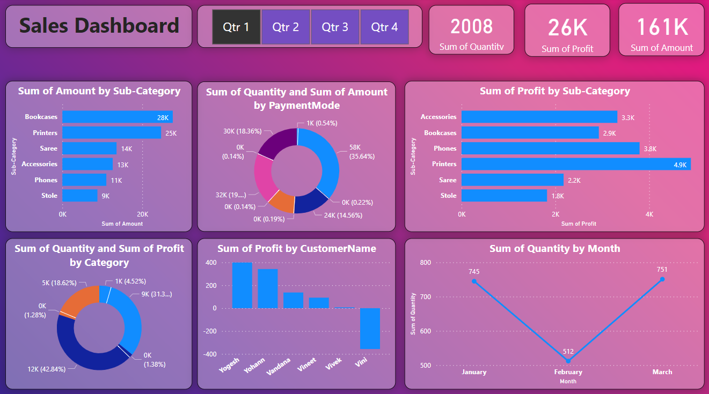

# 📊 Shop Sales Report PowerBi

This repository contains a **Sales Dashboard** created using **Power BI / Excel** to analyze and visualize business sales performance.

---

## 📂 Project Overview

The dashboard provides insights into:

* ✅ Total Sales Amount, Profit, and Quantity
* ✅ Sales Analysis by **Sub-Category**
* ✅ Payment Mode performance
* ✅ Customer-wise Profit
* ✅ Monthly Sales Trends
* ✅ Category and Sub-Category wise performance

---

## 🖼️ Dashboard Preview

---

## 🚀 Features

* Interactive dashboard with filters (Quarter-wise analysis)
* Visual breakdown of sales amount, profit, and quantity
* Pie charts, bar charts, and line charts for better understanding
* Helps identify top-performing categories & customers

---

## 🛠️ Tools Used

* **Power BI / MS Excel** for visualization
* **Sales dataset** (sample business data)

---

## 📌 Insights from Dashboard

* Printers and Bookcases generated the **highest sales amount**.
* Profit was maximum from **Printers (4.9K)**.
* Month-wise, **February** had the lowest sales quantity.
* Customer "Vini" showed a **loss contribution** compared to others.

---

## 🤝 Contribution

Feel free to fork this repo, raise issues, or suggest improvements.

---

## 👨‍💻 Author

**Suraj Kumar**

* GitHub: [surajpathak23](https://github.com/surajpathak23)
* LinkedIn: [Suraj Kumar](https://www.linkedin.com/in/suraj-kumar-2307skp/)
